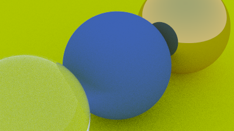
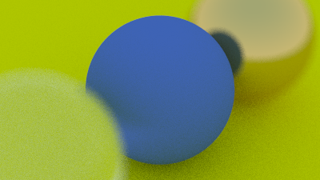
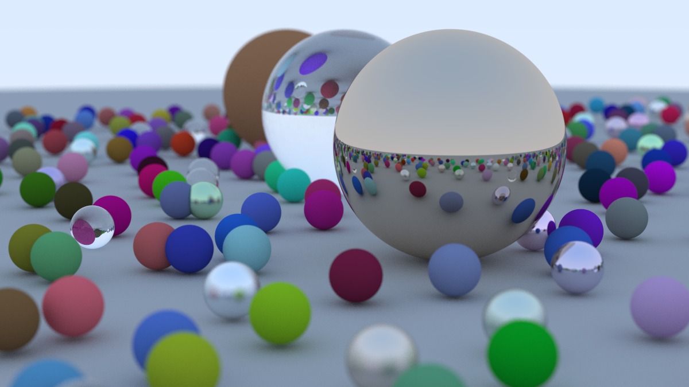

# ray-tracing-in-one-weekend

- [x] data structures (vec3, color, ray, etc.)
- [x] ray generation
- [x] ray-sphere intersection

- [x] sphere with surface normals as color

- [x] placing multiple spheres

- [x] multi-sample anti-aliasing

- [x] Lambertian diffuse material
- [x] ray bouncing

- [x] reflective metal material

- [x] fuzzy metal material

- [x] Snell's Law dielectric material with Schlick's approximation for reflectance

- [x] camera extrinsics & intrinsics

- [x] Defocus Blur (depth of field)

- [x] Milestone 1 final render

- [] Motion Blur

- [] Bounding Volume Hierarchy with AABB

- [] Texture Mapping

- [] Perlin Noise

- [] Quadratic Surfaces

- [] Light

- [] Instances

- [] Volumes